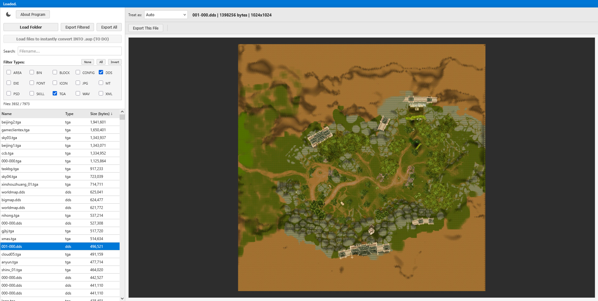

# .AUP-File-Type-Decryptor-and-Viewer

Fully local, client-side tool for (en/de)crypting / (de)compressing the reverse-engineered file format for the custom **.aup** type files, which are used for packing game asset files for the MMORPG "Dragon Soul" (DragonSoul).

More about Dragon Soul and my game file preservation archive for it:  
[https://archive.org/details/Dragon-Soul-DragonSoul-MMORPG-Client](https://archive.org/details/Dragon-Soul-DragonSoul-MMORPG-Client)

You can use the decryptor tool online right in the browser:  
**https://predatoriwd.github.io/.AUP-File-Type-Decryptor-and-Viewer/**

### Features:
- Decrypts/decompresses custom packed Dragon Soul .aup files
- Supports previewing PNG, JPG, BMP, TGA, DDS, custom game icons, WAV, Chinese encoded text (GB18030), ASCII, Hex
- Batch export with folder structure preservation
- Arrow key file list navigation
- TO DO: Encrypts/compresses raw files into the .aup format (bit-perfect)

 

<pre>DECRYPTION ALGORITHM (LZSS Variant)

The .aup files use a custom implementation of LZSS (Lempel-Ziv-Storer-Szymanski) compression based on a ring buffer dictionary.

1. HEADER:
   - First 4 bytes (Little Endian Integer) indicate the uncompressed size.

2. BIT STREAM:
   - The stream is read bit-by-bit (MSB first).
   - It maintains a 16384 byte (0x4000) Ring Buffer (History).
   - Initial Buffer Index: 1

3. COMMANDS:
   BIT = 1 (LITERAL BIT):
       - Read next 8 bits as a raw byte.
       - Append to Output.
       - Write to Ring Buffer.
       - Increment Buffer Index (wrapping at 0x3FFF).

   BIT = 0 (MATCH BIT):
       - Read next 14 bits = Offset (Absolute position in Ring Buffer).
       - If Offset = 0, Stop (End of File).
       - Read next 4 bits = Length.
       - Actual Length = Length + 3.
       - Iterate [Actual Length] times:
           - Read byte from Ring Buffer at [(Offset + i) & 0x3FFF].
           - Append byte to Output.
           - Write byte to Ring Buffer.
           - Increment Buffer Index (wrapping at 0x3FFF).</pre>

---
<small>*This is an unofficial fan project not affiliated with the original developers; all Dragon Soul assets and intellectual property belong to their respective owners.*</small>